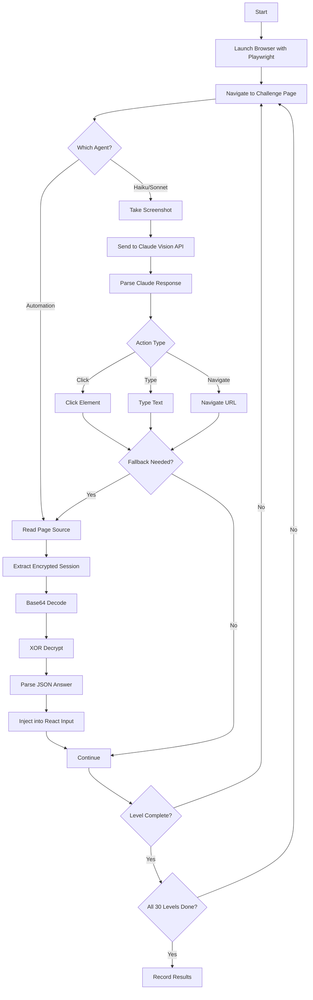
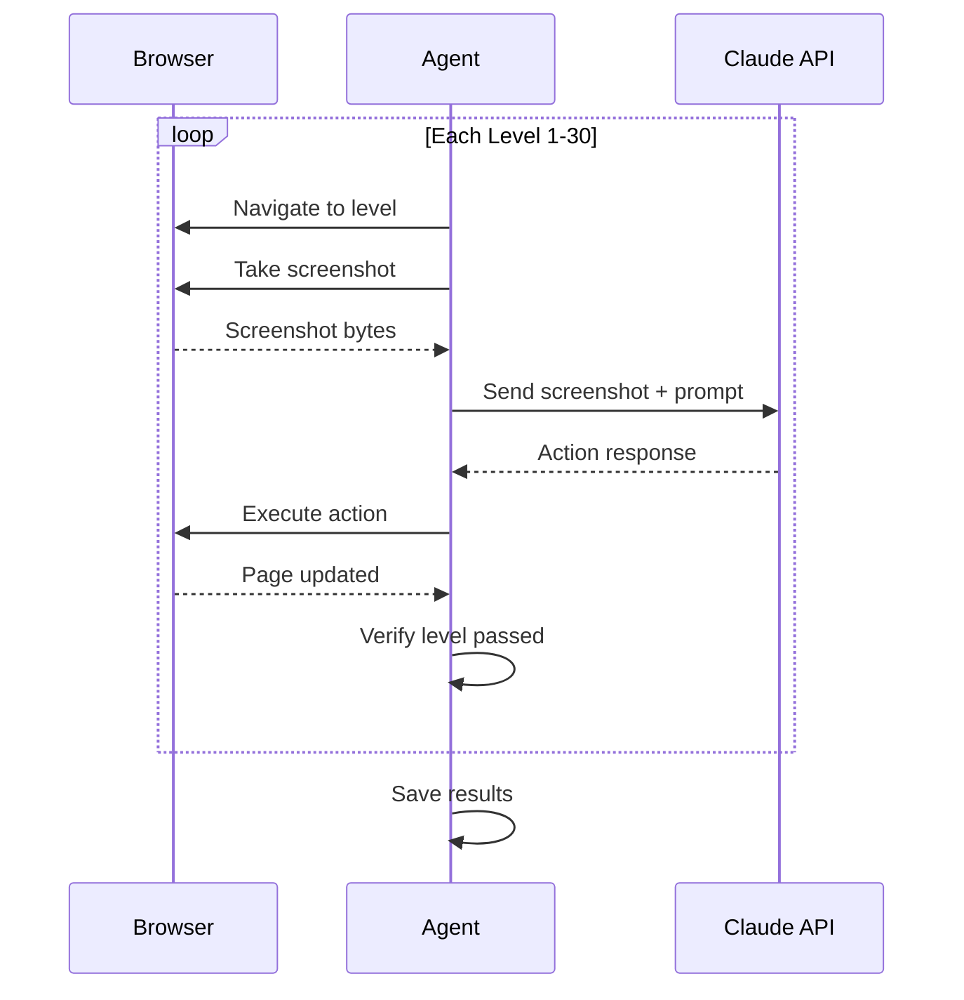
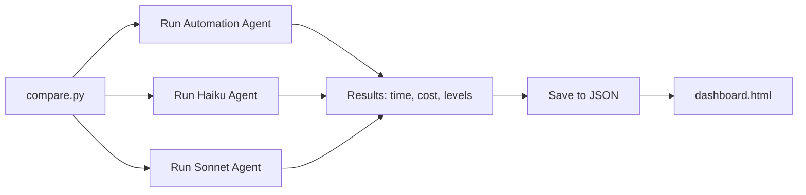

# Browser Challenge Bot — Architecture

## Agent Flow

```mermaid
flowchart TD
    A[Start] --> B[Launch Browser with Playwright]
    B --> C[Navigate to Challenge Page]
    C --> D{Which Agent?}

    D -- Automation --> E[Read Page Source]
    E --> F[Extract Encrypted Session]
    F --> G[Base64 Decode]
    G --> H[XOR Decrypt]
    H --> I[Parse JSON Answer]
    I --> J[Inject into React Input]

    D -- Haiku/Sonnet --> K[Take Screenshot]
    K --> L[Send to Claude Vision API]
    L --> M[Parse Claude Response]
    M --> N{Action Type}
    N -- Click --> O[Click Element]
    N -- Type --> P[Type Text]
    N -- Navigate --> Q[Navigate URL]
    O & P & Q --> R{Fallback Needed?}
    R -- Yes --> E
    R -- No --> S[Continue]

    J --> S
    S --> T{Level Complete?}
    T -- No --> C
    T -- Yes --> U{All 30 Levels Done?}
    U -- No --> C
    U -- Yes --> V[Record Results]
```

## Vision Agent Pipeline

```mermaid
sequenceDiagram
    participant B as Browser
    participant A as Agent
    participant C as Claude API

    loop Each Level 1-30
        A->>B: Navigate to level
        A->>B: Take screenshot
        B-->>A: Screenshot bytes
        A->>C: Send screenshot + prompt
        C-->>A: Action response
        A->>B: Execute action
        B-->>A: Page updated
        A->>A: Verify level passed
    end
    A->>A: Save results
```

## Agent Comparison

```mermaid
flowchart LR
    A[compare.py] --> B[Run Automation Agent]
    A --> C[Run Haiku Agent]
    A --> D[Run Sonnet Agent]
    B --> E[Results: time, cost, levels]
    C --> E
    D --> E
    E --> F[Save to JSON]
    F --> G[dashboard.html]
```
