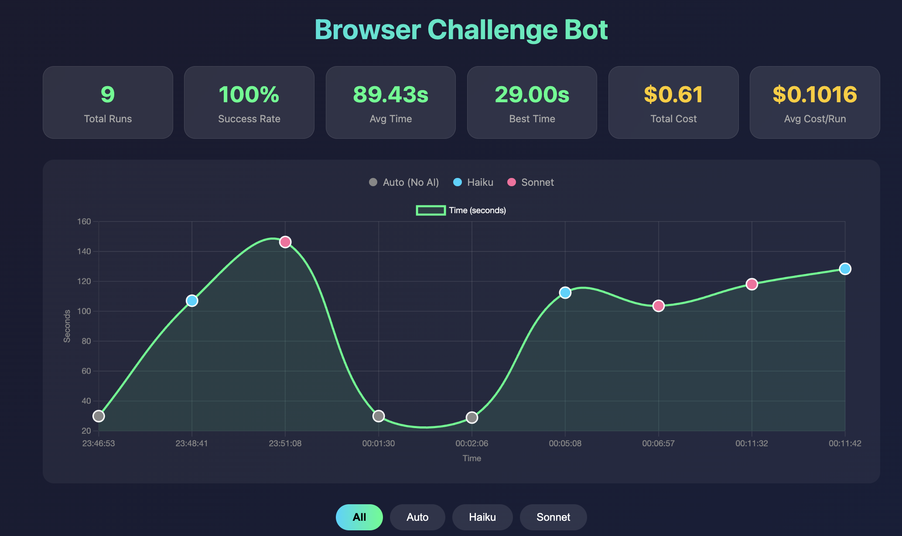

# Browser Navigation Challenge Bot

Three agents that solve all 30 levels of the browser challenge.



| Agent | How it works | Cost |
|-------|--------------|------|
| **Automation** | No AI - decrypts session codes directly | $0 |
| **Haiku** | Claude Haiku vision + fallback | ~$0.04/run |
| **Sonnet** | Claude Sonnet vision + fallback | ~$0.15/run |

## Setup

```bash
git clone https://github.com/mitchhall16/browser-challenge-bot.git
cd browser-challenge-bot
pip install -r requirements.txt
playwright install chromium
```

**For Haiku/Sonnet:** Add your Anthropic API key:

```bash
cp .env.example .env
# Edit .env and add your key
```

## Run

```bash
# No AI (free)
python3 agent-auto.py

# With AI (requires API key)
python3 agent-haiku.py
python3 agent-sonnet.py
```

**Benchmark one agent:**
```bash
python3 run_multiple.py auto 5     # Run automation 5 times
python3 run_multiple.py haiku 3    # Run haiku 3 times
```

**Compare all agents:**
```bash
python3 compare.py                 # Runs all 3 once, shows comparison
```

## View Results

```bash
python3 view_results.py            # CLI summary
open dashboard.html                # Visual dashboard
```
